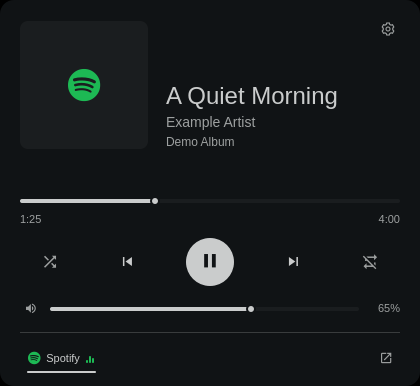

# Foamy Media

Spotify and YouTube playback controls. Also supports spotifyd and spotify-player.



## Install

```sh
omarchy plugin add https://github.com/foamrider/foamy-media.git --enable
```

## Use

- Start playback, then left-click the widget to open the player.
- Right-click to play/pause; middle-click to skip to the next track.
- Use the panel for seeking, volume, shuffle, repeat, and source selection.
- Open the cog to change controls, appearance, language, and browser settings.

For YouTube, open **Browser settings → Use an open window** and select your
YouTube web app. Start a video first if it is not detected. Check the browser
and profile; ordinary browser tabs are not automatically detected.
The widget hides when no supported player has a track by default.

## License

Licensed under [MIT](LICENSE). Based on [Spotmarchy](LICENSE-SPOTMARCHY), with
[Omarchy](LICENSE-OMARCHY) and [Lucide](LICENSE-LUCIDE) components.

Provided **as is**, without warranty or guaranteed support. Use at your own risk.
