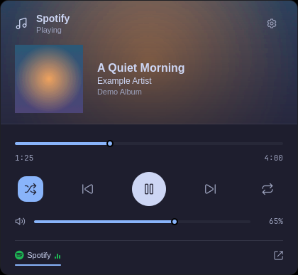

# Foamy Media

Spotify and the dedicated YouTube web app in the Omarchy bar: the track, a
progress underline and an equalizer in the bar, and a player popup with the
cover, seeking, transport, volume and source switching. Also works with
spotifyd and spotify-player.



## Install

```sh
omarchy plugin add https://github.com/foamrider/foamy-media.git --enable
```

Built for Omarchy 4.5; it also loads on Omarchy 4.0.

Requires an MPRIS player (Spotify, spotifyd, spotify-player, or a
Chromium-family browser for YouTube). Optional:

- Covers and the album-colour band: `curl` and ImageMagick (`magick`).
  Without them the popup shows the source icon on the foamy band.
- YouTube: Hyprland and the configured browser, started through `uwsm-app`.
- Pasting into the settings fields: `wl-paste` (wl-clipboard), `jq` and
  `timeout` (coreutils), all part of Omarchy. Pastes are capped at 16 KiB and
  two seconds; a failed paste leaves the field unchanged and shows an error.

## Use

- Start playback, then left-click the widget to open the player. Right-click
  plays or pauses; middle-click skips to the next track. A setting swaps the
  left and right buttons.
- The mouse wheel over the widget skips tracks by default (one skip per
  touchpad swipe), or changes the player volume.
- In the popup: seek, previous/next, play/pause, shuffle and repeat
  (Spotify), volume, and a tab per open source when Spotify and YouTube both
  run. The button at the bottom right shows or starts the selected source.
- The widget hides when no supported player has a track; paused tracks stay
  visible. Turn off **Hide when stopped** to keep a dimmed source icon.

Keyboard: Up/Down (or `j`/`k`) move the cursor between rows; Left/Right (or
`h`/`l`) move along the transport and source rows, seek five seconds on the
timeline and change the volume on the volume row. Enter or Space activates
(play/pause when nothing has the cursor), `s` opens Settings, Tab and
Shift-Tab switch to the next bar panel, Esc closes (or leaves Settings).
Hovering moves the same cursor.

For YouTube, open **Settings → YouTube → Browser settings → Use an open
window** and pick your YouTube web app (start a video first if it is not
listed). Check the browser and profile; ordinary browser tabs are never
treated as the web app.

### Covers

Covers come only from Spotify's and YouTube's image hosts over HTTPS (no
redirects, 8 MB cap) or from a local file. A probe identifies the format from
the file's bytes, decodes it under ImageMagick resource limits and writes a
re-encoded PNG to `$XDG_CACHE_HOME/foamy-media/covers` (mode 0700, named by
the cover's content, so a player that reuses one file path for every track
still gets the new cover). The popup only ever loads that copy. Remote covers
wait for the network to settle and are retried up to three times. A cover
that cannot be fetched or read is never replaced by the previous track's
cover: the popup shows the source icon until the new one arrives.

### What runs, and when

- One player model per shell: with a bar on several monitors, the source
  selection, the cover download and the position updates run once.
- While playing, the bar re-reads the position about once per pixel the
  underline grows (at most once a second), and twice a second while the popup
  is open. Nothing ticks while playback is paused or stopped.
- The bar equalizer steps eight times a second while playing, and the popup's
  equalizers only while the popup is open. A long title pans only while
  playing with the popup closed. With animations off (`omarchy toggle
  animations` on Omarchy 4.5) the equalizers stand still and titles rest
  elided.
- Covers are decoded only while the popup is open.
- While the popup is open the bar's open-panel mark takes the place of the
  progress underline, so the two never overlap.

## Settings

Open the cog (or press `s`). Every change is saved to the widget's entry in
Omarchy's `shell.json`.

| Setting | Default | What it does |
|---|---|---|
| Left-click plays/pauses | off | Swaps the left and right buttons |
| Mouse wheel | Previous/next track | Or Volume, or Nothing |
| Volume step (%) | 5 | Wheel volume step, 1–20 |
| Hide when stopped | on | Hides the widget when no player has a track |
| Show the artist in the bar | on | |
| Show progress in the bar | on | The underline |
| Scroll long titles | on | Pans titles wider than the label width |
| Show the equalizer | on | In the bar and on the source tabs |
| Label width (px) | 200 | 60–600 |
| Accent | Source color | Spotify green / YouTube red, Album art, Theme accent or Bar foreground |
| Artwork background | on | The cover as the popup's header band (blurred) |
| Artwork intensity (%) | 55 | How much cover shows through, 0–100 |
| Enable YouTube | on | |
| Browser, Profile | vivaldi, Default | Start the YouTube web app |
| Window app ID, MPRIS name | Vivaldi web app | Under **Advanced** |

With Omarchy's CPU rendering the header band shows the cover sharp under a
readability scrim, and the thumbnail is square (the blur, the adaptive scrim and
the rounded mask need the GPU renderer). Without a cover the band keeps the
foamy tinted wash.

Language follows **Omarchy → Setup → Language** on Omarchy 4.5 (English and
Norwegian catalogs; right-to-left languages mirror the popup and settings,
while the timeline, transport and volume keep their direction). Omarchy 4.0
shows English.

## IPC

```sh
omarchy-shell foamy.media playPause   # also: next, previous, shuffle, loop, launch
omarchy-shell foamy.media toggle      # also: open, close, settings
omarchy-shell foamy.media status      # JSON: source, track, position, state
```

Transport calls answer `ok`, or `unhandled` when the player can't do it.

## Remove

```sh
omarchy plugin remove foamy.media
```

Removal stops the widget. Spotify, browser profiles, YouTube web apps,
playback and the cover cache (`$XDG_CACHE_HOME/foamy-media`) remain.

## Development

`kit/` holds shared components copied from [foamy-kit](https://github.com/foamrider/foamy-kit); edit them there, not here.

```sh
node tests/model-test.js && node tests/network-test.js && node tests/preferences-test.js
node tests/browser-setup-test.js && node tests/i18n.test.cjs
sh tests/probe-test.sh                 # the real cover probe; needs ImageMagick
python3 -I tests/test_clipboard.py
python3 tests/i18n-runtime.py          # OMARCHY_PATH=<4.5 tree> checks 4.5
bash tests/kit-check.sh
python3 -I tests/runtime.py            # offscreen, 4.0 and 4.5 hosts; needs foamy-kit (FOAMY_KIT)
```

Shared components live in `kit/`, copied from
[foamy-kit](https://github.com/foamrider/foamy-kit); change them there and
run its `sync.sh`. `preview/Preview.qml` holds mock states for the kit's
screenshot harness.

## License

Licensed under [MIT](LICENSE). Based on [Spotmarchy](LICENSE-SPOTMARCHY).
Omarchy and Lucide notices for the shared components are in
[kit/LICENSE-OMARCHY](kit/LICENSE-OMARCHY) and [kit/LICENSE-LUCIDE](kit/LICENSE-LUCIDE).

Provided **as is**, without warranty or guaranteed support. Use at your own risk.
